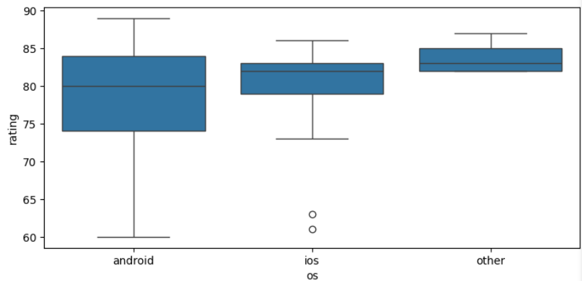
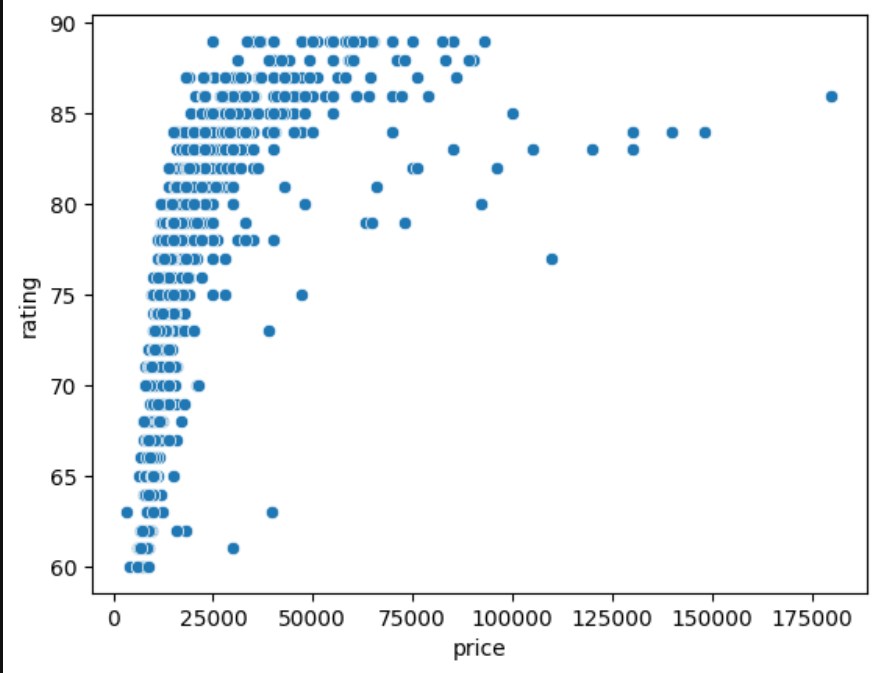
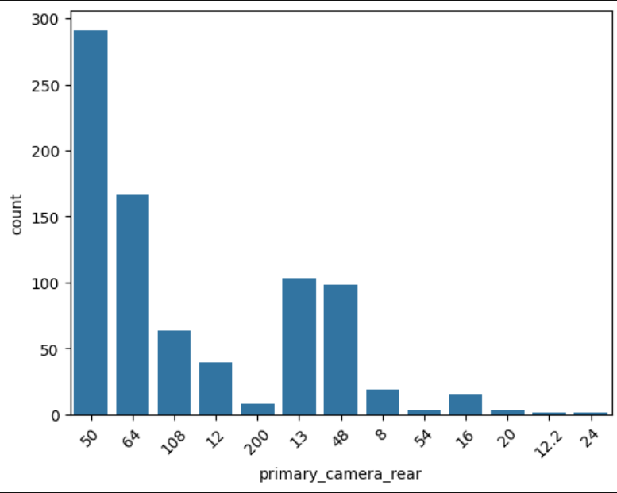

# Smartphone-Feature-Impact-Analysis-Score-Prediction: Project Overview  

- Built a predictive model (**MAE: 2.18, R²: 0.95**) to quantify smartphone scores, helping **product managers** optimize product positioning.  
- Scraped 1000 smartphone records from Smartprix using **Python, BeautifulSoup, and Selenium**.  
- Conducted **EDA** to analyze key factors influencing scores and preprocess data.  
- Engineered features to refine specifications and optimize model input.  
- Evaluated models (**Linear Regression, Decision Tree, Random Forest, Gradient Boosting**) and selected **Random Forest** for its balance of **accuracy and interpretability**.  
- Deployed via **FastAPI (backend), Streamlit (frontend), Docker (containerization), and Render.com**, with **CI/CD using GitHub Actions**.  

## Resources & Documentation  

- **Python Version** → 3.10
- **Project Technical Documentation** → [Technical Docs](./docs/Technical_Details.md)  
- **Dataset Source** → [Scraped Data](data/raw/smartphones.csv)  
- **Live Demo** → [Application Link](https://smartphone-spec-score-analysis-frontend-xoj2.onrender.com)  
- **Postman Collection** → [API Testing Collection](https://crimson-equinox-345795.postman.co/workspace/My-Workspace~393a6c73-8b4d-435b-8c76-ad0f04e4d33b/collection/26974525-35da8e7e-fd28-42a2-bf07-f936d0729216?action=share&creator=26974525)

## Web Scraping Summary

- **Source:** Extracted approximately **1000 smartphone specifications & scores** from the Smartprix website.

- **Tools Used:** BeautifulSoup, Selenium

- **Challenges:** Managed **dynamic page scrolling** and **anti-bot mechanisms**

- **Collected Fields**

| Field       | Description                  |
|------------|------------------------------|
| model      | Smartphone model name        |
| price      | Price of the smartphone      |
| rating     | Smartprix rating score       |
| sim        | SIM type (e.g., Dual SIM)    |
| processor  | Processor details            |
| ram        | RAM capacity                 |
| battery    | Battery capacity             |
| display    | Display specifications       |
| camera     | Camera specifications        |
| card       | Expandable storage support   |
| os         | Operating system             |

## Data Cleaning  

After scraping the data, I cleaned and structured it to ensure consistency, completeness, and accuracy. The following modifications were made:

### 1.1 Quality Issues  
- **Model**: Standardized brand names for consistency.  
- **Price**: Removed '₹' symbol and commas for numerical validity.  
- **Price**: Identified an anomaly where Namotel was priced at ₹99.  
- **Ratings**: Filled in missing values.  
- **Processor**: Fixed incorrect values for certain Samsung phones.  
- **Irrelevant Data**: Removed an iPod entry.  
- **Memory**: Corrected invalid entries.  
- **Battery**: Fixed incorrect values.  
- **Display**: Addressed missing frequency values and fixed incorrect data.  
- **Foldable Phones**: Consolidated scattered information.  
- **Camera**: Standardized descriptions of Dual, Triple, and Quad cameras; merged front and rear camera info.  
- **Camera Errors**: Fixed inconsistencies in multiple rows.  
- **Card Slot**: Removed unrelated OS and camera details.  
- **OS**: Cleaned incorrect values and removed unrelated Bluetooth/FM radio info.  
- **OS Versions**: Standardized OS version naming.  
- **Missing Values**: Addressed missing data in **camera, card, and OS** columns.  
- **Data Types**: Converted **price** and **rating** columns to numerical types.  

### 1.2 Tidiness Issues  
- **SIM**: Split into `has_5G`, `has_NFC`, and `has_IR_Blaster`.  
- **RAM**: Separated into `RAM` and `ROM`.  
- **Processor**: Extracted `Processor Name`, `Cores`, and `CPU Speed`.  
- **Battery**: Separated into `Battery Capacity` and `Fast Charging Availability`.  
- **Display**: Split into `Size`, `Resolution Width`, `Resolution Height`, and `Frequency`.  
- **Camera**: Separated into `Front Camera` and `Rear Camera`.  
- **Card Slot**: Split into `Supported` and `Extended Storage Limit`.

## EDA  

- Conducted missing value analysis to identify incomplete data 
- Analyzed the distributions of the data and examined value counts for various categorical variables.  
- Identified numerical variables that could be converted into categorical features for better representation.  
- Explored feature associations using statistical methods and visual techniques.  

Below are a few highlights of the EDA analysis :  

    
    
    

## Feature Engineering  

### Feature Construction  
- Constructed **Performance Score** using processor speed, number of cores, and RAM capacity.  
- Derived **Battery Efficiency** using battery capacity and screen size.  
- Computed **Camera Quality Score** by combining rear and front camera resolutions.  
- Created **Connectivity Features Count** based on the presence of 5G, NFC, and IR Blaster.  
- Calculated **Storage Expandability** using expandable memory capacity.  

### Handling High-Cardinality Categorical Columns  
- Addressed categorical variables with numerous unique values by appropriate encoding techniques.  

### Missing Value Analysis  
- **Rating column**: Found MCAR; removed missing values as it is the target variable.  
- **Primary Camera Front**: Had only one missing value (MCAR); dropped the row.  
- **Processor Brand**: Imputed most frequent value within the brand; assigned "Unknown" where all data was missing.  
- **Num Cores & Processor Speed**: Missing values mainly in Apple and Nokia; dropped these rows (~0.69%).  
- **Processor Brand**: 33 missing values (~3.77%); dropped as MCAR.  
- **Battery Capacity**: Imputed missing Apple values with the median battery capacity for Apple.  
- **Extended Storage**: Missing values only for phones with expandable storage; imputed using the global median.  
- **Fast Charging Capacity**:  
  - **Consistent brands** (LG, OnePlus, Xiaomi, Vivo): Used uniform imputation.  
  - **High missing percentage** (Samsung - 17%, Apple - 36%): Used brand-specific median imputation.  
  - **Low missing percentage** (Sony, Xiaomi, Oppo, Motorola, Google - 2-8%): Used median imputation.  
  - **Minimal impact brands** (Blu, Leitz, Sharp): Removed single missing values.
 

## Model Building  
- Split the data into train and test sets (80-20 split).  
- Evaluated baseline models:  
  - **Linear Regression**: Higher R² score but lacked flexibility.  
  - **Decision Tree**: Performed well but had higher variance.  

### Advanced Model Selection  
- Tested **Random Forest** and **Gradient Boosting**.  
- Chose **Random Forest** for:  
  - Handling numerical & categorical features efficiently.  
  - Faster inference time for real-time deployment.  
  - Better interpretability using SHAP.  

### Hyperparameter Optimization  
- Tuned **Random Forest** using **Optuna**.  
- Achieved **MAE: 2.18, R²: 0.95** on the optimized model.  

### Experiment Tracking  
- Used **MLflow** for tracking experiments and model performance.  

## Model Evaluation  
- Evaluated models on the test set and using cross-validation.

### Baseline Models  
| Model               | Test Error | R² Score (Test) |
|---------------------|------------|-----------------|
| Linear Regression  | 1.7349     | 0.9416          |
| Decision Tree      | 1.8037     | 0.8749          |

### Advanced Models  
| Model                   | Test Error | R² Score (Test) |
|-------------------------|------------|-----------------|
| Gradient Boost         | 1.2070     | 0.9523          |
| Random Forest (Untuned) | 1.1564     | 0.9535          |
| Random Forest (Tuned)   | **1.0800** | **0.9549**      |

## Deployment and Serving  

### Model Deployment  
- Deployed using **FastAPI** for real-time inference.  
- Frontend built with **Streamlit**.  
- Hosted on **Render.com** (free instance).  

### Microservices Architecture  
- **API Service:** FastAPI + Model Inference.  
- **Frontend Service:** Streamlit UI.  
- **Dockerized Deployment** for portability.  

### CI/CD Pipeline  
- **GitHub Actions** automates deployments.  

### Monitoring & Logging  
- **Custom Logging Module** implemented.  
- Observability setup planned for future iterations.  

### Deployment Infrastructure  

| Component      | Technology Used          |
|---------------|--------------------------|
| Model Server  | FastAPI + Uvicorn        |
| Frontend      | Streamlit                |
| Deployment    | Render.com (Free Instance) |
| CI/CD         | GitHub Actions           |
| Containerization | Docker                 |

