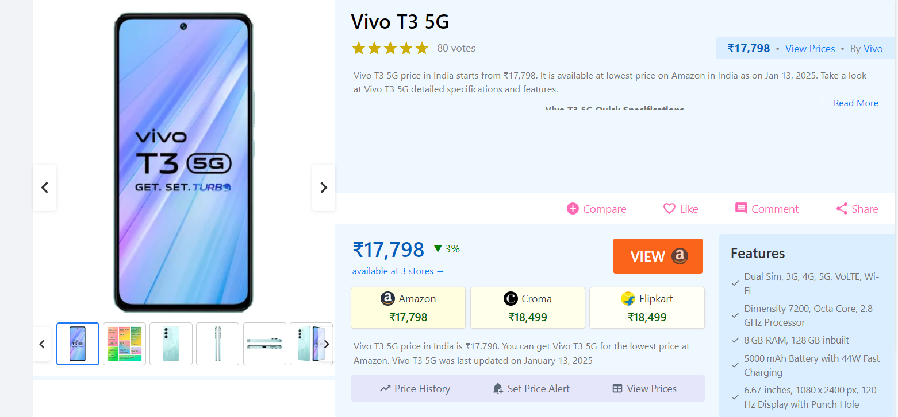

# Project Summary Documentation

## Project Goal
Understand how these specification scores are determined -> how to improve upon it.

Higher Smartprix ratings increase visibility and perceived value, potentially boosting sales as customers rely on these scores when making purchase decisions.

  

*Figure: Smartprix website showcasing how it enhances product visibility and perceived value, influencing customer purchase decisions.*

## Stakeholder
- Product Manager of a well-established smartphone brand.

## Proposed Solution

### Key Features:
1. **Provide Interpretability:**
   - Enable stakeholders to understand which features have the most significant impact on the specification score, empowering them to make informed decisions about feature prioritization and design for future smartphone launches.

2. **Predict Specification Scores:**
   - Allow stakeholders to input features of a hypothesized smartphone and predict its expected Smartprix specification score, facilitating better strategic planning during product development.

3. **User Access via Web Application:**
   - Develop a user-friendly web application to make the model accessible, enabling stakeholders to explore feature impacts, input hypothetical smartphone configurations, and view predictions in real time.

## Deliverables
- Interpretability presentation
- Web app
- Project documentation (in markdown format)

## Key Metrics

### R-Squared (R²): "Explaining Variance = Predictable Trends"
- **Technical Meaning:**
  - R² measures how well the model captures the relationship between smartphone features and their specification scores.
- **Why It Matters to the Business:**
  - High R² (> 0.8) means the model can reliably predict specification scores based on feature design. This predictability translates into strategic planning confidence:
    - Investors: “Our predictive system captures 85% of what drives a phone’s score.”
    - Product Managers: “We can focus on feature combinations we know will lift Smartprix ratings by X%, ensuring higher customer visibility.”
- **Business Metric Tied To It:**
  - % improvement in product rating portfolio (avg spec score): A consistently high spec score across products boosts brand value and sales.

### Mean Absolute Error (MAE): "Accurate Predictions = Actionable Insights"
- **Technical Meaning:**
  - MAE quantifies how far the predicted scores deviate from actual scores on average.
- **Why It Matters to the Business:**
  - A low MAE (±5 points) ensures stakeholders can trust predictions to make product decisions:
    - Example: “If we predict a spec score of 90 for a flagship phone, the actual score is typically between 85-95.”
    - Accurate predictions build stakeholder trust and reduce risks during product launches.
- **Business Metric Tied To It:**
  - Hit Rate for Target Rating Goals:
    - “X% of our predicted top-rated phones scored 90+ in actual reviews.”
    - This improves confidence in design investments and reassures investors about prediction reliability.

## Scope and Limitations

### Scope
- **Focus Areas:**
  - Analyze smartphone specifications to predict Smartprix ratings.
  - Provide interpretability insights into feature impact on scores.
  - Enable stakeholders to explore hypothetical smartphone configurations via a web app.

### Limitations
- **Excluded Factors:**
  - External influences such as market trends, customer reviews, or competitor strategies are not considered.
  - Predictions are limited to the accuracy of the input data and model assumptions.
- **Scalability:**
  - As a proof-of-concept (PoC) project, the web application is hosted on Streamlit Cloud and may not support large-scale production deployment without further optimization.

