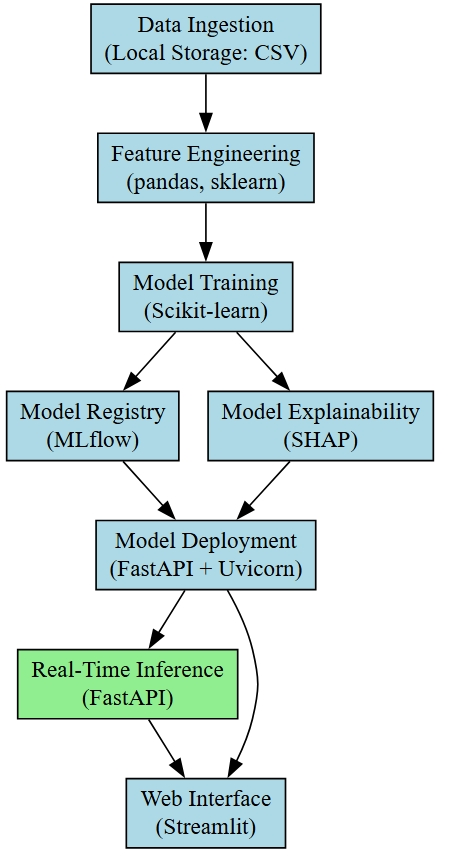

# Technical Documentation: 

## 1. Requirements Gathering

### A. Scope Clarification

1. What is the system supposed to do?
   - Predict Smartprix specification scores for smartphones based on their features.
   - Provide interpretability to help stakeholders understand which features have the most significant impact on the score.
   - Enable stakeholders to input features for a hypothetical smartphone and predict its specification score.
2. Who are the primary users?
   - Product managers of smartphone brands aiming to improve product design and strategy.
3. What are the boundaries of the system?
   - The system focuses only on predicting and interpreting specification scores, not on direct sales or customer feedback analysis.
   - It relies on structured smartphone specification data (e.g., processor, camera, battery) and existing Smartprix ratings.
4. What problem are we solving for the stakeholders?
   - Helping them design smartphones with higher specification scores by understanding feature impact.
   - Enabling informed decisions during product development with reliable predictions and actionable insights.

### B. Functional Requirements

1. Prediction Functionality:
   - Predict the Smartprix specification score based on the provided features using a regression model.
2. Interpretability Features:
   - Provide feature importance rankings (e.g., which features have the highest impact on scores).
   - Offer partial dependency plots or SHAP-based interpretations for deeper insights.
3. Hypothetical Device Scoring:
   - Allow users to input custom feature values for a new smartphone and generate its predicted score.
4. Data Handling:
   - Ingest and preprocess smartphone specification data.
   - Handle missing values, normalize numerical features, and encode categorical ones.
5. Web Application Integration:
   - Host a user-friendly interface for stakeholders to input features, view predictions, and explore interpretability results.
6. Model Evaluation:
   - Evaluate model performance with metrics like R² and MAE.

### C. Non-functional Requirements

1. Performance:
   - Predictions should be generated in under 2 seconds to ensure seamless interaction in the web application.
2. Reliability:
   - The system should provide consistent results across multiple runs, with minimal variance.
3. Interpretability:
   - The outputs must be easily understandable by non-technical stakeholders, with visual aids like bar charts or plots.
4. Maintainability:
   - Use modular and well-documented code to enable easy updates and debugging.
5. Usability:
   - Provide an intuitive interface for non-technical users, focusing on simplicity and clarity.

## 2. Architecture Planning

### High-Level Architecture

Below is the high level architecture overview:

  

*Figure: High-Level Architecture Overview illustrating the data flow from ingestion to real-time inference and explainability*

### Technology Stack & Justifications

| Component            | Technology Choices                         | Justification |
|----------------------|-------------------------------------------|--------------|
| **Data Ingestion**   | Local Storage (CSV)                      | Since this is a PoC with limited data, local storage is sufficient. Can be extended to a database if needed. |
| **Feature Engineering** | pandas, scikit-learn                   | Efficient libraries for handling numerical & categorical features. |
| **Model Training**   | XGBoost / LightGBM / Scikit-learn         | Suitable for structured data with numerical and categorical features. Provides fast training and high interpretability. |
| **Model Registry**   | MLflow                                    | Tracks experiments, manages models, and supports versioning. |
| **Model Deployment** | FastAPI + Uvicorn                         | Lightweight, scalable API framework for real-time inference. |
| **Inference**        | FastAPI Endpoints                         | Ensures real-time predictions with low latency. |
| **Explainability**   | SHAP                                      | Helps interpret model decisions, improving transparency. |
| **Web Interface**    | Streamlit                                 | Interactive UI for user input, visualization, and displaying model results. |

### Evaluation Strategy and Key Metrics

| **Layer**              | **Evaluation Strategy**                                                                             | **Key Metrics**                              |
| ---------------------- | --------------------------------------------------------------------------------------------------- | -------------------------------------------- |
| Modeling Frameworks    | Cross-validation, parameter tuning (grid search), and feature importance analysis.                  | R² (>0.8), MAE (±5 points).                  |
| Interpretability Tools | Visual inspection of SHAP plots, stakeholder feedback on interpretability.                          | SHAP value consistency, usability.           |
| Web Application        | Usability tests with stakeholders, app responsiveness checks.                                       | Interaction time (<2 seconds).               |

### Key Metrics

| **Metric**                    | **Technical Meaning**                                                | **Business Relevance**                                                  | **Example Outcome**                                                |
| ----------------------------- | -------------------------------------------------------------------- | ----------------------------------------------------------------------- | ------------------------------------------------------------------ |
| **R-Squared (R²)**            | Explains how much variance in scores is captured by the model.       | High R² (> 0.8) ensures reliability for strategic planning.             | "85% of score variance explained by smartphone features."          |
| **Mean Absolute Error (MAE)** | Quantifies average deviation of predicted scores from actual scores. | Low MAE (±5 points) boosts trust in predictions for critical decisions. | "Predicted flagship score of 90 typically within 85-95."           |
| **Interaction Time**          | Measures web app responsiveness.                                     | Enhances user satisfaction with seamless interactions.                  | "Predictions generated within 1.5 seconds for 95% of inputs."      |

## 3. Data Pipeline Design

### A. Data Collection

#### Overview
- Scraping data from **Smartprix** website using **Selenium** (for dynamic content) and **BeautifulSoup** (for parsing HTML).
- Data includes smartphone specifications for predictive modeling.

#### Data Collection Methodology
1. **Selenium**: 
   - Automates browser actions: applies filters, clicks, and scrolls to load dynamic content.
   - Saves page source to a local HTML file after interacting with the website.
2. **BeautifulSoup**:
   - Parses the saved HTML file.
   - Extracts smartphone details such as model, price, specs, and ratings.

#### Key Data Fields
- **Brand Name**: Smartphone brand (e.g., Apple, Samsung).
- **Model**: Specific model name.
- **Price**: Retail price.
- **Rating**: Specification score.
- **Specs**: processor, RAM, battery, display, camera, expandable storage, OS.

For a detailed data dictionary, refer to the [Data_Dictionary](../references/Mobile_Insight_Data_Dictionary.xlsx).

#### Data Scraping Process
- **Initialization**: Set up Selenium with `chromedriver.exe`.
- **Opening Page**: Load the target Smartprix URL.
- **Applying Filters**: Use XPath to apply filters (e.g., smartphone category).
- **Scrolling**: Simulate scrolling to load all products.
- **Save HTML**: Store page source in a local HTML file for extraction.
- **Close Driver**: Quit the Selenium driver after scraping.

#### Data Export
- **Extraction**: Parse HTML to extract required data.
- **Storage**: Convert data to a pandas DataFrame.
- **Export**: Save data as a CSV file for further analysis.

#### Tools Used
- **Selenium**: Automates web interactions.
- **BeautifulSoup**: Parses HTML for data extraction.
- **Pandas**: Stores and exports data.

## 4. Training Infrastructure

### Model Selection Process

### **Baseline Models**
Before selecting a complex model, we evaluated simple baseline models:

| Model               | Test Error | R² Score (Test) |
|---------------------|-----------|----------------|
| **Linear Regression** | 1.7349    | 0.9416         |
| **Decision Tree**    | 1.8037    | 0.8749         |

While **Linear Regression** performed better in terms of R² score, it lacked the flexibility to capture complex interactions. Decision Trees performed well but had higher variance.

---

### **Exploring More Advanced Models**
After evaluating baseline models, we tested **all linear models, Random Forest, and Gradient Boosting**.

#### **Performance Comparison**
Both **Random Forest and Gradient Boosting** had **similar performance metrics**, but **Random Forest** was chosen due to its **higher interpretability** while maintaining competitive accuracy.

---

#### **Why Random Forest? (Key Considerations)**

### **1. Data Size & Type**
- The dataset consists of **structured numerical and categorical data** (smartphone specs).
- **Random Forest** naturally handles categorical and numerical features **without requiring extensive preprocessing**.

---

### **2. Latency Requirements (Random Forest vs. Gradient Boosting)**
Since **real-time inference** is required (FastAPI deployment), model inference speed is a crucial factor.

| Model               | Inference Complexity |
|---------------------|----------------------|
| **Random Forest**   | (O(k log n)) |
| **Gradient Boosting** | (O(k d)) |

- **Random Forest:** Performs inference in **(O(k log n))** time, where \(k\) is the number of trees and \(n\) is the number of samples in each tree. Since trees are independent, inference can be parallelized, making it **faster** for real-time scenarios.
- **Gradient Boosting:** Inference complexity is **\(O(k d)\)**, where \(d\) is the depth of each tree. Since boosting trees are applied sequentially, inference is inherently **slower** than Random Forest.
- **Random Forest** provides a **better trade-off** between **accuracy and inference speed**, making it suitable for **low-latency** systems.

---

### **3. Interpretability Needs**
- **SHAP (SHapley Additive Explanations)** can be used with **Random Forest** to explain feature importance.
- **Feature importance scores** from **Random Forest** are easier to interpret **compared to boosting models**, where feature interactions are more complex.

## Deployment and Serving

### Model Deployment Strategy
We deploy the model for **real-time inference** using **FastAPI** due to:  
- **Asynchronous Programming:** FastAPI efficiently handles multiple requests with `async` capabilities.  
- **Pydantic Validation:** Ensures strict input data validation, reducing errors in API calls.  
- **Performance:** Built on Starlette and Uvicorn, making it **faster than Flask** for handling high-concurrency requests.  

### Scalability & Performance
- **Hardware Requirements:**  
  - Deployed on a **free instance (Render.com)**  
  - **512MB RAM, 0.1 vCPU** (sufficient for low-load real-time inference)  
- **Microservices Architecture:**  
  - **Two microservices:**  
    - **API Service (FastAPI + Model Inference)**  
    - **Frontend Service (Streamlit UI)**  
  - **Dockerized Deployment:** Each service is packaged as a **Docker container** for portability.  
- **CI/CD Pipeline:**  
  - **GitHub Actions** automates deployments when new code is pushed.  

### API Endpoints & Input/Output Schema
Full API documentation & testing: [Postman Collection](https://crimson-equinox-345795.postman.co/workspace/My-Workspace~393a6c73-8b4d-435b-8c76-ad0f04e4d33b/collection/26974525-35da8e7e-fd28-42a2-bf07-f936d0729216?action=share&creator=26974525) 

### Monitoring & Logging
- Logging done through custom logging module.
- Observability will be setup in the project in the next iteration.

### Deployment Infrastructure

| Component        | Technology Used            |
|-----------------|---------------------------|
| **Model Server** | FastAPI + Uvicorn         |
| **Frontend**     | Streamlit                 |
| **Deployment**   | Render.com (Free Instance) |
| **CI/CD**       | GitHub Actions            |
| **Containerization** | Docker                 |

